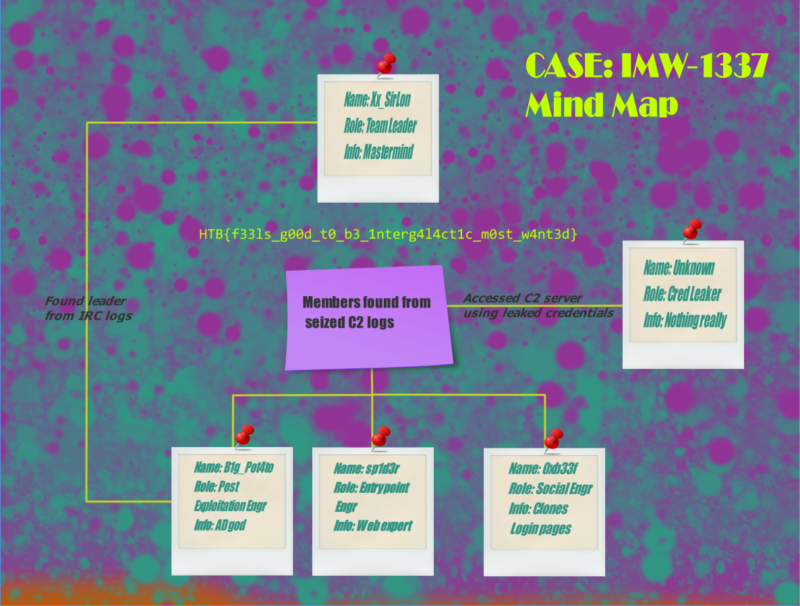

# FORENSICS - INTERGALACTIC RECOVERY

This time we are challenged to recover a Raid 5 disk that has been partially damaged.

As much as I understand, a Raid 5 disk is composed by three or more drives where data is stripped and stored in a particular way. Furthermore, Raid 5 includes parity bits between the data. This allows data integrity checks and even the recovery in case of a drive failure.

If we analyze the given files, we can see three different disk images that seem to be the different parts of the corrupted Raid 5 disk:

Looking at the file size, we can see that **disk1.img** and **disk2.img** have the same size, however, **disk3.img** is very small in size. From here we can deduce that **disk3.img** might be the damaged drive.

After spending a lot of time unsuccessfully trying different tools and reading a lot about raid 5 disks, I finally found a way to recover a Raid 5 disk in a manual way.

We can recover the third drive (the damaged one) by making a **bitwise XOR** between **disk1.img** and **disk2.img**.

To achieve this, I took some [code](https://gist.github.com/albinoloverats/562cf1f72262bc4ffe5f) from *albinoloverats* GitHub repo, so here we can do the same.

Once downloaded and compiled, we just need to run it:

	./xor disk1.img disk2.img diskxor.img

Now, we should have an extra image called **diskxor.img**, which should have the same size as **disk1.img** and **disk2.img**.

At this point, we already have the three necessary drives to create a Raid 5 array.

In order to be able to create the Raid 5 array with *mdadm*, we need to associate our images with loop devices. To achieve this goal, we can run the following:

	sudo losetup /dev/loop1 disk1.img
	sudo losetup /dev/loop2 disk2.img
	sudo losetup /dev/loop3 diskxor.img
	
Then we can proceed to create the Raid 5 array with *mdadm*. There exists many order combinations, however, after a few tries I came up with the following:

	sudo mdadm --create --assume-clean --level=5 --raid-devices=3 /dev/md0 /dev/loop2 /dev/loop3 /dev/loop1

Finally, we just need to access to **/dev/md0**. Here we can find a pdf file that contains what we were looking for.

